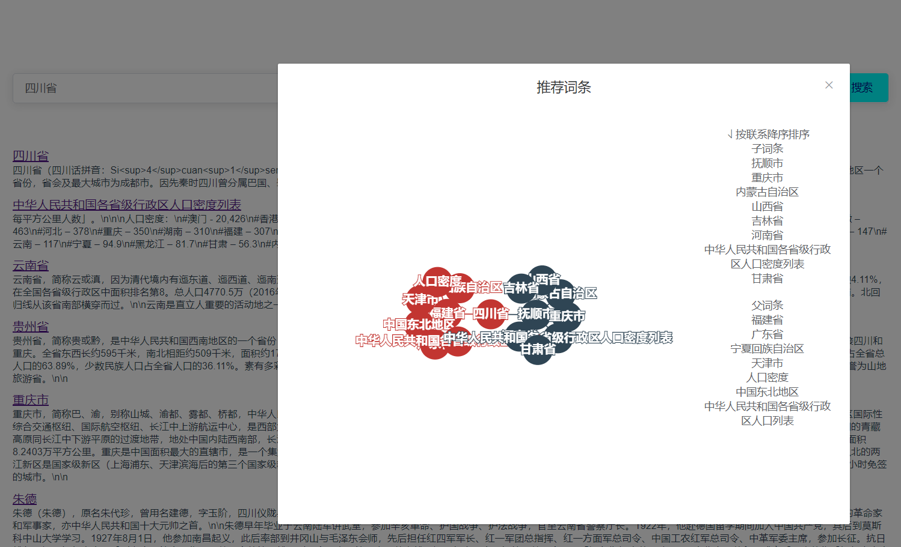
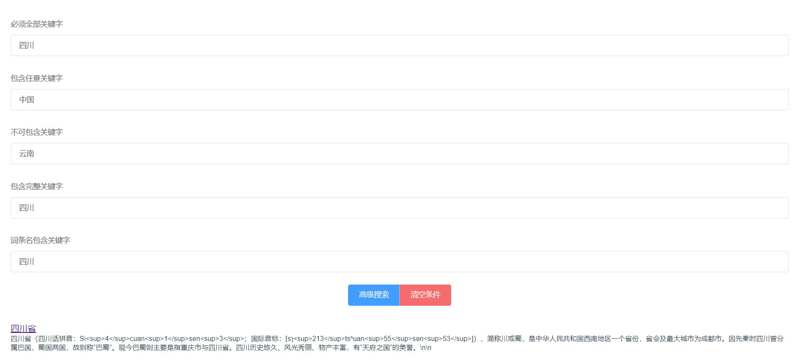
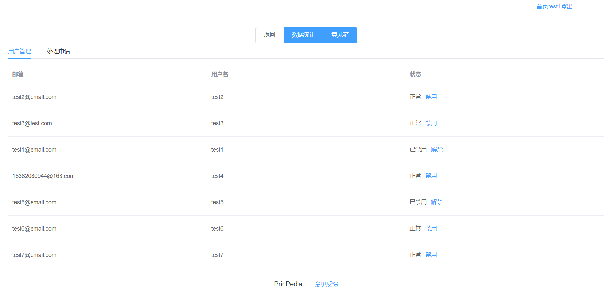
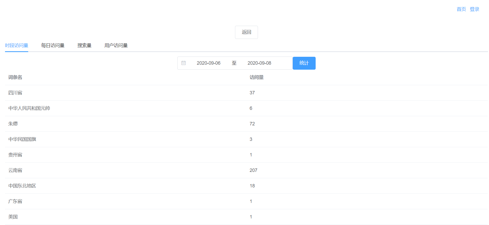
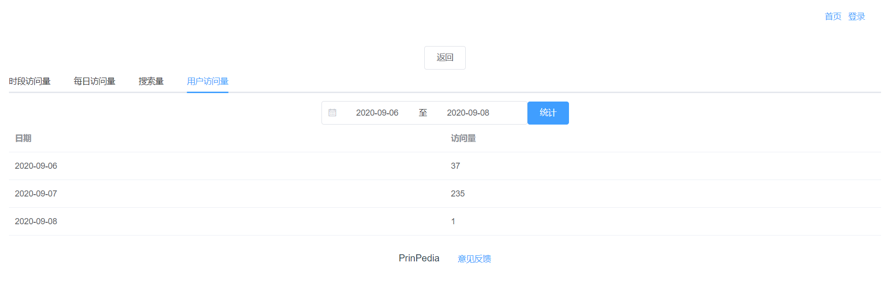
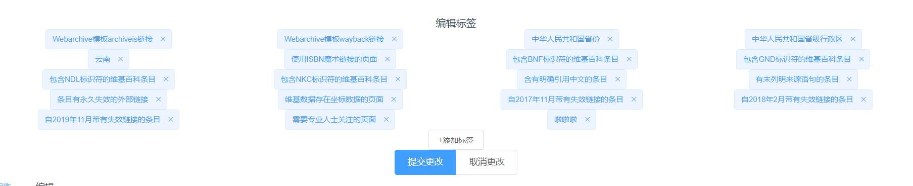

# PrinPedia 功能性需求实现
---
## 搜索篇
### 基本搜索
搜索采用elastic search搜索引擎，以搜索词在词条标题和摘要中出现的次数为依据，最后按照所得权重从大到小进行排序展示，同时会显示排序第一词条的关联图表  

### 高级搜索
本项目支持进行同时满足多种条件的高级搜索，其中包括
+ 条目***必须包含***关键字
+ 条目***应该包含***关键字
+ 条目***不能包含***关键字
+ 条目***必须完全包含***关键字
+ 条目标题***必须完全包含***关键字

---
## 词条篇
本项目以WikiText格式显示和编辑wiki文本。在用户提交修改版本后，管理员可以查看它们，并决定是否将该版本应用到当前条目。除此之外，管理员可以锁定或解锁条目，以保护它们不被非法操纵。

---

## 用户篇
本项目允许用户注册自己的账户，并记录其相关的用户信息。
### 注册&登录
用户需要提供邮箱、用户名和密码进行注册，登录时仅需要输入用户名和密码，***注：***使用重复用户名进行注册时会显示注册失败

### 用户信息
用户可以提供其邮箱和生日，在未来的规划中将在生日当天向用户发送邮件庆祝生日（该功能尚未实现）
### 收藏

用户在用户信息页可以看到自己已经收藏的词条

---
## 管理篇
### 用户管理
管理员可以查看所有用户的列表信息，并可以对指定用户进行封禁和解禁

### 数据统计
在管理员权限下可以查看搜索本项目的使用情况，其中包括
+ 所有条目在一定时期内的访问次数和访问次数

+  一个条目在某段时间内每天被访问多少次

+ 某段时间内执行了多少次搜索操作

+ 在某个时间段内，登录操作执行了多少次

### 意见反馈
用户可以发起意见反馈，管理员可以收到用户发起的反馈并给予回复

---
## 标签篇
本项目实现了针对词条的标签系统，用户可以增加、修改和删除词条所对应的标签，***注：***在词条锁定状态下将不能修改标签

